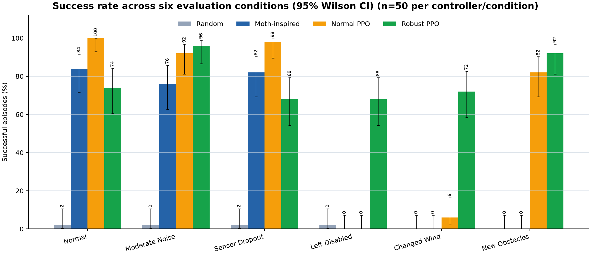
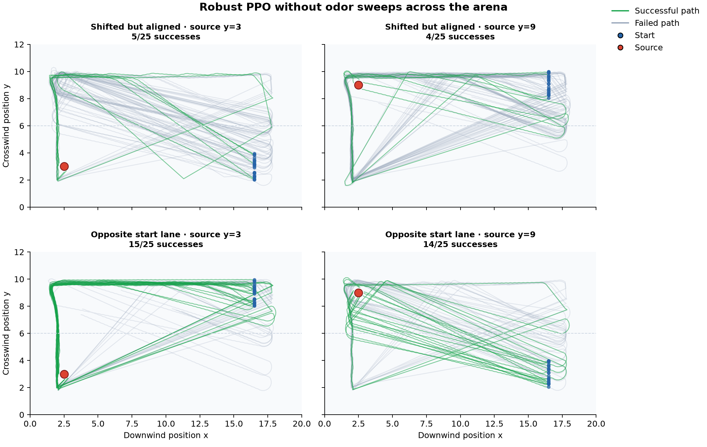
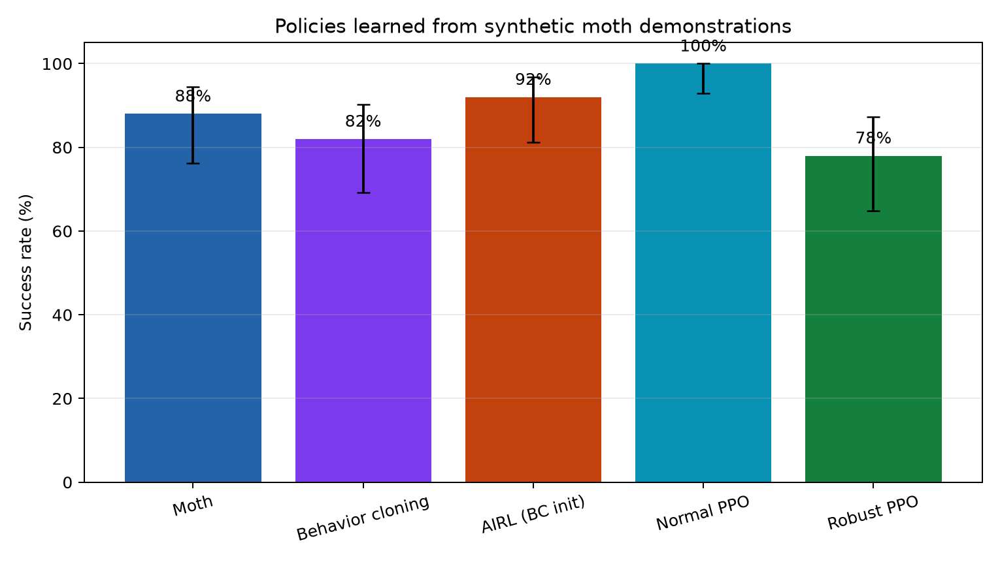

# Robust Bio-Inspired Odor Source Search with Reinforcement Learning

I built a synthetic 2D robotics environment where an agent searches for a
hidden odor source using two unreliable odor sensors, wind direction, short
sensor memory, and local obstacle rays. I compared a moth-inspired controller
with normal and domain-randomized PPO, tested which cues the learned policies
used, and inferred a reward from synthetic moth demonstrations with AIRL.


## Key results

- Normal PPO reached **100%** success under normal sensing and **0%** when its
  left odor sensor was disabled.
- Robust PPO recovered **68%** success with the failed sensor and **72%** under
  changed wind, but normal performance fell to **74%**.
- A valid but incorrect wind direction reduced both learned policies to at most
  **2%**, showing that they relied on the angle rather than merely receiving a
  valid vector.
- A geometry test contradicted my first explanation of Robust PPO. Trajectories
  revealed a broad wind-oriented sweep rather than a straight upwind route.
- From 100 successful synthetic moth demonstrations, behavior cloning reached
  **82%** and BC-initialized AIRL reached **92%** on a separate 50-seed test.
  The 10-point paired difference was not conclusive (`p = 0.18`).

The main robustness result is a tradeoff. Normal PPO learned an efficient but
narrow solution. Domain randomization produced a wider and more
failure-tolerant search strategy at the cost of nominal performance.

The demonstrations, environments, and plume are synthetic. This project is not
a biological model, CFD simulation, or reproduction of another research
group's implementation.

## Task and simulator

The world is 20 by 12 abstract units. A source emits odor puffs that drift
downwind, spread laterally, and decay. Two virtual sensors sit in front of the
agent like antennae. Sensor noise, random dropout, and complete unilateral
failure can be configured independently.

The agent succeeds when it reaches the source radius before the 600-step
evaluation limit. It never observes source coordinates, source distance,
global position, or a plume map.

The six discrete actions are forward, gentle left or right while moving, sharp
left or right in place, and still. The 13 policy inputs contain:

- current left and right odor readings, their difference, and detection state;
- normalized time since detection and eight-reading odor averages;
- sine and cosine of heading relative to wind;
- the previous action;
- front, left, and right obstacle proximity.

The simulator is independent of Gymnasium and Stable-Baselines3. The same core
dynamics run interactive demos, hand-designed controllers, PPO policies, and
paired evaluations.

## Controllers and training

### Moth-inspired baseline

The finite-state baseline uses three readable behaviors:

| State | Behavior |
|---|---|
| `SURGE` | Move on odor and steer toward the stronger sensor or upwind |
| `ZIGZAG` | Alternate short moving turns after losing odor |
| `LOOP` | Search a wider area after a longer odor gap |

Any odor detection returns the controller to `SURGE`. This is an original
engineering baseline using broad ideas from odor-guided insect navigation, not
a claim about exact moth behavior.

### PPO

I used PPO because it trained reliably with the short vector observation,
discrete actions, and parallel environments. The actor and critic each use two
hidden layers of 128 units.

The hand-written training reward combines:

- `+50.0` for reaching the source;
- `-0.01` per step;
- `-0.35` for a collision;
- `+0.01` for odor detection;
- `0.60 * distance progress`.

Distance is privileged training information used only to calculate reward. It
is absent from the policy observation. This makes training practical but is an
explicit limitation.

Normal PPO trained for about 100,000 steps. Robust PPO trained for about
200,000 steps while each episode randomized sensor noise, dropout, left or
right sensor failure, wind within plus or minus 15 degrees, and two obstacle
layouts. I selected checkpoints on separate validation seeds before the final
evaluation.

## Main robustness evaluation

The final matrix used four controllers, six conditions, and 50 paired seeds per
cell, for 1,200 episodes. A controller received the same stochastic seed, start
pose, condition, and step limit as every other controller in its paired episode.

| Controller | Normal | Noise | Dropout | Left off | Wind +15° | Other obstacles |
|---|---:|---:|---:|---:|---:|---:|
| Random | 2% | 2% | 2% | 2% | 0% | 0% |
| Moth-inspired | 84% | 76% | 82% | 0% | 0% | 0% |
| Normal PPO | **100%** | 92% | **98%** | 0% | 6% | 82% |
| Robust PPO | 74% | **96%** | 68% | **68%** | **72%** | **92%** |



The alternative obstacle layout and changed-wind range appeared during robust
training. Those results measure performance within its randomized training
distribution, not generalization to entirely unseen physics or geometry.

Raw episode rows, aggregate metrics, Wilson confidence intervals, and paired
design metadata are stored under [`results/data`](results/data).

## What the policies used

I kept both model files frozen and changed only policy inputs at inference time.
The physical plume and sensors continued to run normally.

| Test | Normal PPO | Robust PPO | Interpretation |
|---|---:|---:|---|
| Hide odor | 100% to 16% | 68% to 50% | Normal PPO depended more heavily on odor |
| Hide wind | 98% to 52% | 74% to 22% | Both policies used wind direction |
| Hide odor and wind | 98% to 0% | 74% to 0% | Neither solved the task without either cue |
| Rotate valid wind by 90° | 100% to 0% | 70% to 2% | Correct wind angle was essential |

The rotated-wind control mattered because setting sine and cosine to zero
creates an invalid direction vector. Rotating the vector preserved unit length
while supplying a plausible but wrong angle. This showed that the zero-vector
result was not only an unusual-input artifact.

### The result that changed my interpretation

I initially thought Robust PPO was following a mostly straight upwind route
from the familiar downwind start region. I tested that explanation by moving
sources to upper and lower lanes and placing starts either in the same lane or
the opposite lane.

| Policy | Input | Aligned lanes | Opposite lanes |
|---|---|---:|---:|
| Normal PPO | Full | 96% | 42% |
| Normal PPO | Odor hidden | 22% | 0% |
| Robust PPO | Full | 100% | 96% |
| Robust PPO | Odor hidden | 18% | 58% |

My prediction was wrong. With full input, Robust PPO retained 96% success. Its
odor-hidden trajectories crossed most of the arena height, which was consistent
with a broad wind-oriented sweep. The opposite-lane setup placed the source
inside that sweep more often.



The lane design is still not independent continuous geometry because the start
lane predicts the other source lane. I do not treat this result as unrestricted
generalization or as proof of the network's internal representation.

## Learning from demonstrations

I added behavior cloning as a learnability check before attempting reward
inference. The experiment retained the first 100 successful moth-controller
episodes from a fixed seed range, producing 25,298 state-action transitions.
The learned policies received the same 13 local inputs as PPO. Neither behavior
cloning nor AIRL used the simulator's distance-based reward.

The first AIRL setup started from a random policy. Its discriminator separated
expert and generated behavior too quickly, and the policy collapsed toward
moving straight ahead. I replaced that failed setup with a declared
BC-initialized AIRL run, reduced discriminator capacity and updates, selected
one of six rounds on 30 validation seeds, and moved final evaluation to untouched
seeds 15000 through 15049.

Physical success on the validation episodes selected the AIRL round. It was not
used as a stepwise reward during BC or AIRL training. Source contact still ends
an episode, so the method retains a physical task boundary.

| Policy | Success | 95% Wilson interval | Mean successful steps | Mean collision events |
|---|---:|---:|---:|---:|
| Moth demonstrator | 88% | 76.2% to 94.4% | 258.0 | 62.0 |
| Behavior cloning | 82% | 69.2% to 90.2% | 254.2 | 86.8 |
| BC-initialized AIRL | **92%** | 81.2% to 96.8% | 257.5 | 33.1 |
| Normal PPO | 100% | 92.9% to 100% | 134.0 | 0.0 |
| Robust PPO | 78% | 64.8% to 87.2% | 159.5 | 0.0 |



AIRL succeeded on seven seeds where behavior cloning failed, while behavior
cloning alone succeeded on two seeds where AIRL failed. The exact paired
McNemar test gave `p = 0.1797`. The success difference is promising but not
conclusive. The collision reduction is also descriptive because I trained only
one BC/AIRL run.

This phase shows that the synthetic demonstrations are learnable and that a
reward can be inferred without source distance. It does not recover a biological
reward. Real moth trajectories and repeated training seeds are required before
making that claim.

## Quick start

Python 3.11 or newer is required.

```bash
python3 -m venv .venv
source .venv/bin/activate
python -m pip install --upgrade pip
python -m pip install -e ".[all]"
python scripts/run_demo.py --controller moth --seed 7
```

Run the release checks:

```bash
pytest
ruff check .
ruff format --check .
```

Reproduce the main comparison or demonstration-learning phase:

```bash
python scripts/run_experiments.py --episodes 50 --seed-start 3000
python scripts/generate_milestone4_artifacts.py
python scripts/run_irl_experiment.py
```

Exact model paths, seed ranges, training commands, and output files are in
[`docs/REPRODUCING_RESULTS.md`](docs/REPRODUCING_RESULTS.md). The
[`architecture note`](docs/ARCHITECTURE.md) explains the code path.

## Repository map

```text
src/biosearch/
  config.py               world and plume parameters
  environment.py          core movement and collision dynamics
  plume.py                stochastic puff transport
  sensors.py              bilateral sensing and uncertainty
  gym_environment.py      observations, hand-written reward, and Gymnasium API
  controllers/            random and moth-inspired baselines
  training/               PPO training and evaluation
  experiments.py          paired controller evaluation
  ablations.py            inference-only cue interventions
  geometry.py             source and start geometry tests
  irl.py                  demonstrations, behavior cloning, and AIRL
  visualization/          renderer, plots, and GIF generation

scripts/                  runnable demos and experiments
tests/                    57 unit and integration tests
results/                  selected raw data, figures, and animations
models/                   selected PPO, BC, AIRL, and reward checkpoints
docs/                     architecture and reproduction notes
```

## Limitations

- The plume is qualitative, two-dimensional, and unaffected by obstacles.
- Hand-reward PPO uses hidden source distance for reward shaping.
- Each PPO, BC, and AIRL setup was trained once. Evaluation seeds do not measure
  variation across independently trained policies.
- AIRL starts from the BC policy, so its result must be compared with BC rather
  than presented as learning from scratch.
- AIRL still uses source contact to end an episode and validation success to
  choose a checkpoint.
- The AIRL success difference over BC was not statistically conclusive.
- The IRL demonstrations come from my synthetic controller, not moths.
- Most robust conditions stay inside the domain-randomization ranges.
- The geometry intervention uses two fixed lanes rather than independently
  sampled continuous coordinates.
- None of the results establish biological behavior or real-robot performance.

## Implemented research influences

These papers connect to choices that are present in the repository. I did not
copy their experiments or source code.

- Ando and Kanzaki (2015): bilateral olfaction and surge/zigzag behavior in
  silkmoths. [doi:10.1242/jeb.124834](https://doi.org/10.1242/jeb.124834)
- Voges et al. (2014): reactive odor search, Infotaxis, crosswind zigzagging,
  and short-term memory.
  [doi:10.1371/journal.pcbi.1003861](https://doi.org/10.1371/journal.pcbi.1003861)
- Yamada et al. (2021): odor, wind, and visual cue integration in silkmoth
  navigation. This motivated the valid but incorrect wind-direction test.
  [doi:10.7554/eLife.72001](https://doi.org/10.7554/eLife.72001)
- Hernandez-Reyes et al. (2022): deep inverse reinforcement learning from silk
  moth trajectories.
  [doi:10.1109/TMRB.2021.3129113](https://doi.org/10.1109/TMRB.2021.3129113)
- Fu et al. (2018): adversarial inverse reinforcement learning.
  [arXiv:1710.11248](https://arxiv.org/abs/1710.11248)
- Shigaki et al. (2026): context-dependent compensation after unilateral
  olfactory sensor loss.
  [doi:10.1038/s44182-026-00080-5](https://doi.org/10.1038/s44182-026-00080-5)

[`RESEARCH_LOG.md`](RESEARCH_LOG.md) contains the chronological record,
including failed predictions, interpretation changes, and the discarded IRL
setups. The code is available under the [MIT License](LICENSE).
