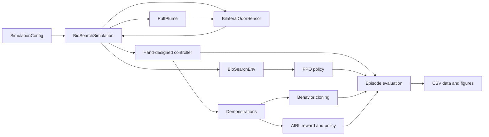

# Architecture

This note is the code walkthrough I wanted when I started the project. It
explains where one simulation step goes, which information reaches a policy,
and which parts I kept separate so experiments remain understandable.

## Main data flow

`BioSearchSimulation` is the center of the project. It owns the world, agent,
plume, sensors, collision checks, and episode history. It does not depend on
Gymnasium or Stable-Baselines3, so the same simulation can run a hand-designed
controller, an interactive demo, or an RL policy.

## One simulation step

The step order in `environment.py` is:

1. Convert the discrete action into a heading change and proposed motion.
2. Reject motion that intersects a boundary or obstacle.
3. Advance the plume by one step.
4. Read the plume at the two sensor positions.
5. Update success, termination, and recorded history.

That order is fixed for every controller. A policy cannot receive an earlier
sensor update or bypass collision handling.

## World and plume

`config.py` contains immutable dataclasses for the world, agent, plume, and
sensors. `SimulationConfig` recreates the world used for every reported
experiment. The plume is deliberately cheap: puffs drift downwind, spread with
random motion, and decay. Obstacles affect the agent but not the plume.

## Observations and hidden state

`gym_environment.py` converts local simulation state into 13 policy values:

- left and right odor readings;
- their difference and a thresholded detection flag;
- time since odor contact;
- sine and cosine of heading relative to wind;
- previous action;
- short odor moving averages;
- front, left, and right obstacle rays.

The source position and source distance are absent. The environment does use
distance change inside the training reward. That is privileged training
information, not policy input. The distinction is tested in
`tests/test_gym_environment.py` and stated in the README because it affects how
I interpret the result.

## Controllers

The random and moth-inspired controllers call the core simulation directly.
The moth controller stores its own `SURGE`, `ZIGZAG`, and `LOOP` state. Its
transitions live in one short file so I can explain each decision without
reading the RL code.

PPO uses `BioSearchEnv`, the Gymnasium wrapper. The normal and robust policies
have the same network architecture. Their main difference is the distribution
of environments sampled during training.

`irl.py` runs the demonstration-learning path. It collects successful episodes
from the moth controller while recording the same 13 observations available to
PPO. Behavior cloning trains a policy directly on the actions. AIRL alternates
between a discriminator-derived reward and PPO updates. Neither method receives
the source position, source distance, or the hand-written environment reward.

The reported AIRL policy starts from the behavior-cloning weights. The README
keeps both scores visible so the initialization is not hidden.
Source contact still terminates the episode, and validation success chooses the
saved round. Those task boundaries are recorded in `irl_protocol.json`.

## Experiments

`evaluation.py` defines the conditions and common metrics. `experiments.py`
runs the paired four-controller comparison. The ablation and geometry modules
change policy inputs or initial geometry while leaving the frozen policy files
untouched. `irl.py` contains reusable demonstration, reward, and policy
evaluation code; `scripts/run_irl_experiment.py` owns its fixed protocol and
saved outputs.

I separate three kinds of output:

- episode rows for checking individual outcomes;
- aggregate tables for comparisons and confidence intervals;
- figures and GIFs for presenting the same recorded results.

The plotting code does not contain hard-coded scores.

## Reproducibility

Each reset splits one seed into independent plume and sensor random streams.
Paired comparisons reuse the same episode seed, initial pose, condition, and
step limit for each controller. Model selection uses validation seeds, while
the main evaluation uses seeds 3000 through 3049. Demonstration learning uses
separate demonstration, action-check, validation, and final evaluation ranges.
Its final policy comparison uses seeds 15000 through 15049.

The exact commands and artifact locations are in
[`REPRODUCING_RESULTS.md`](REPRODUCING_RESULTS.md). The chronological reasoning,
including mistakes and rejected ideas, is in [`../RESEARCH_LOG.md`](../RESEARCH_LOG.md).

## Where I would make changes

- Change world constants or create a preset in `config.py`.
- Change movement and collision rules in `environment.py`.
- Change transport behavior in `plume.py`.
- Change sensor uncertainty in `sensors.py`.
- Change policy inputs or rewards in `gym_environment.py`.
- Change demonstration learning or AIRL in `irl.py`.
- Add an evaluation condition in `evaluation.py` before adding it to a script.
- Add presentation code only after the experiment produces saved numeric data.

This separation is deliberate. It keeps a visual change from silently changing
training, and it keeps an experiment script from inventing a second simulator.
